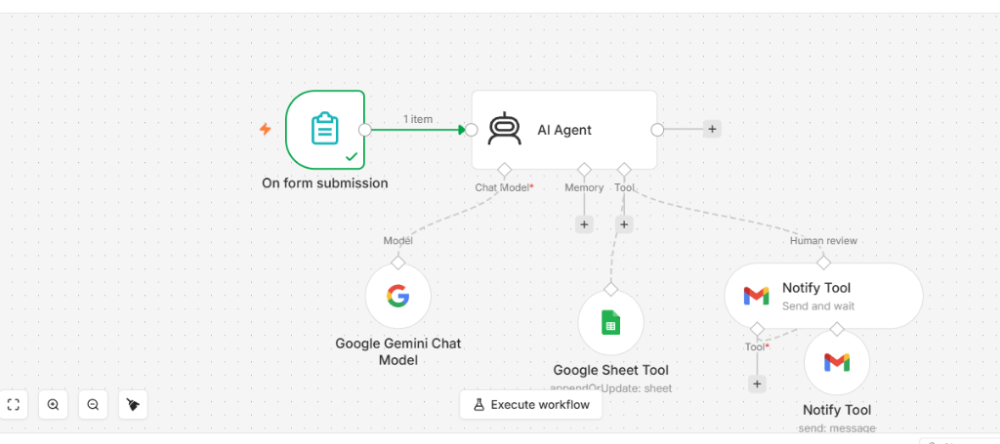
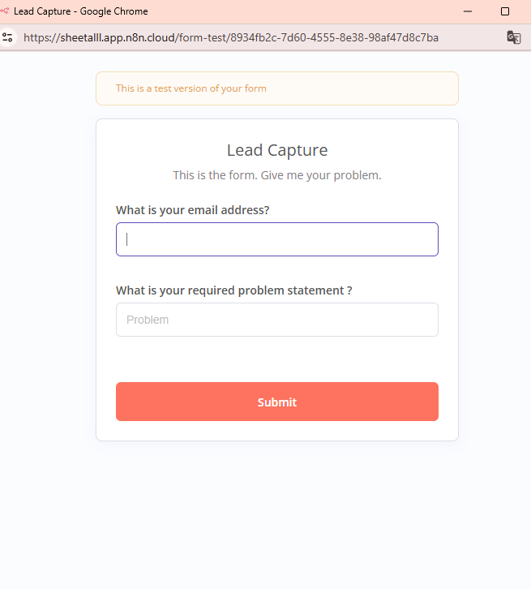
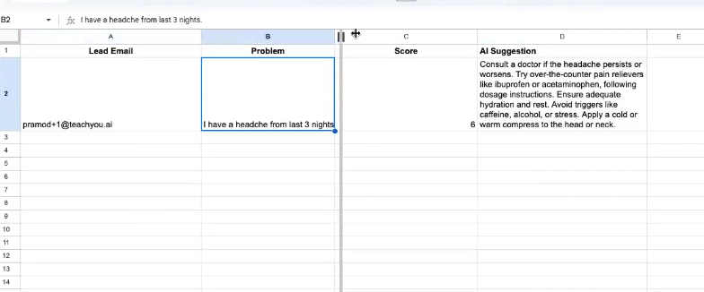
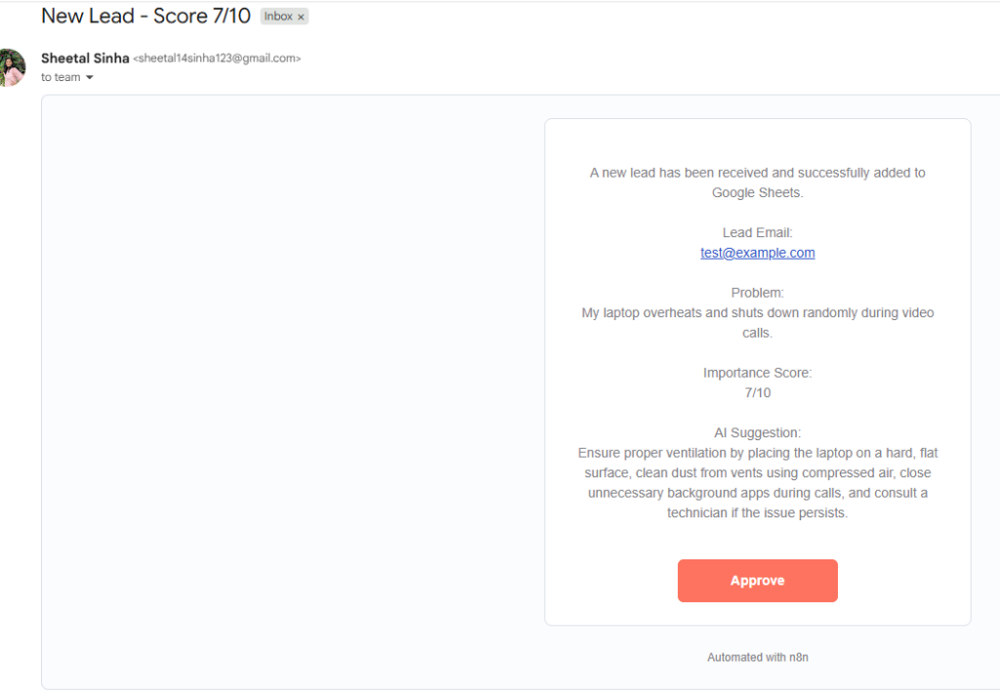

# 🤖 AI Lead Management & Problem Analysis Agent

An intelligent, autonomous end-to-end lead ingestion, issue analysis, priority scoring, Google Sheets database logging, and automated team notification workflow built with **n8n**, **LangChain Agent**, **Google Gemini AI**, and **Gmail**.

[](https://n8n.io)
[](https://ai.google.dev/)
[](https://docs.google.com/spreadsheets)
[](https://mail.google.com)
[](https://github.com/sheetal-sinha/n8n-ai-lead-management-agent/pulls)
[](LICENSE)

---

## 📌 Table of Contents

- [Overview](#-overview)
- [Problem Statement & Solution](#-problem-statement--solution)
- [Key Features](#-key-features)
- [Project Folder Structure](#-project-folder-structure)
- [Screenshots & Visual Demos](#-screenshots--visual-demos)
- [System Architecture & Sequence Flow](#-system-architecture--sequence-flow)
- [AI Priority Scoring Matrix](#-ai-priority-scoring-matrix)
- [Data Schemas (Input & Output)](#-data-schemas-input--output)
- [Technology Stack](#-technology-stack)
- [Quick Start & Installation](#-quick-start--installation)
- [Error Handling & Reliability](#-error-handling--reliability)
- [Documentation](#-documentation)
- [Contributing](#-contributing)
- [License](#-license)

---

## 🔎 Overview

The **AI Lead Management & Problem Analysis Agent** is a production-ready workflow designed to automate customer, technical, or medical inquiry processing.

When a user submits a problem statement through an auto-generated n8n form, the AI Agent:
1. **Parses & Validates Input**: Checks for valid email formatting and non-empty problem statements.
2. **Analyzes Complexity & Urgency**: Uses Google Gemini LLM to assess severity, operational impact, and risk.
3. **Generates Priority Score (1–10)**: Assigns a standardized numerical score reflecting urgency.
4. **Formulates Actionable AI Guidance**: Produces clear, concise, non-hallucinated recommendations.
5. **Persists Lead to Google Sheets**: Formats and appends records into a master database spreadsheet.
6. **Dispatches Automated Email Alerts**: Notifies designated support teams or medical personnel via Gmail for high-priority leads.

---

## 💡 Problem Statement & Solution

### The Challenge
Organizations face significant delays and inefficiencies when processing inbound user support requests:
- **Manual Review Overhead**: Triage teams spend hours manually rating issue severity.
- **Inconsistent Prioritization**: Critical outages or emergencies get lost in generic lead queues.
- **Data Fragmenting**: Inquiries scatter across emails, forms, and disparate tracking tools.

### The Solution
An intelligent automated pipeline that acts as a **24/7 First Responder**:
- **Zero-Latency Processing**: Forms are analyzed within seconds of submission.
- **Objective Scoring**: AI evaluates urgency against a standardized 1–10 rubric.
- **Centralized Database**: Every lead is structured and logged into Google Sheets.
- **Instant Escalation**: High-priority scores automatically trigger high-visibility email notifications.

---

## ✨ Key Features

- 🤖 **LangChain AI Agent Integration**: Combines natural language processing with tool execution capabilities.
- ⚡ **Google Gemini 3.6 Flash Powered**: High-speed reasoning with low latency and precise instruction following.
- 🛡️ **Built-in Strict Data Validation**: Validates email format, non-empty fields, and strict integer scores (1–10) before tool execution.
- 📊 **Automated Google Sheets Logging**: Directly appends validated lead records without manual data entry.
- 🚨 **Conditional Priority Escalation**: Sends targeted email notifications for high-severity (Score 8+) and emergency (Score 10) issues.
- 🔒 **Resilient Tool Execution Flow**: Enforces strict operational sequencing (`Form Input` ➔ `Validation` ➔ `Google Sheets` ➔ `Gmail Notification`).

---

## 📁 Project Folder Structure

```text
n8n-ai-lead-management-agent/
│
├── 📂 workflows/
│   └── ai_lead_management_workflow.json  # Exported n8n workflow file (Ready for 1-click import)
│
├── 📂 screenshots/
│   ├── 01_n8n_workflow_canvas.png        # Active n8n workflow canvas screenshot
│   ├── 02_lead_capture_form.png          # Customer-facing lead intake form UI
│   ├── 03_google_sheets_output.png       # Master Google Sheets database output preview
│   └── 04_email_notification.png        # Automated Gmail notification email preview
│
├── 📂 docs/
│   ├── WORKFLOW.md                       # Complete node specifications & prompt engineering logic
│   └── SETUP_GUIDE.md                    # Step-by-step setup, credential & OAuth guide
│
├── .gitignore                            # Standard git ignore configurations
├── LICENSE                               # MIT License file
└── README.md                             # Comprehensive project documentation
```

---

## 📸 Screenshots & Visual Demos

### 1. n8n Workflow Canvas
*Full view of the node graph featuring Form Trigger, LangChain AI Agent, Google Gemini Chat Model, Google Sheets Tool, and Gmail Notify Tool.*



---

### 2. Lead Capture Form
*Modern, clean user-facing form for capturing user emails and problem descriptions.*



---

### 3. Google Sheets Output
*Real-time master spreadsheet logging Lead Email, Problem Statement, Priority Score (1–10), and AI Suggestion.*



---

### 4. Gmail Notification Alert
*Automated email notification sent via Gmail with lead details, priority score (7/10), AI suggestion, and approval trigger.*



---

## ⚙️ System Architecture & Sequence Flow

```text
[ User Form Submission ]
           │
           ▼
┌───────────────────────────┐
│  On Form Submission       │  <-- (Form Trigger Node)
└─────────────┬─────────────┘
              │
              ▼
┌───────────────────────────┐
│        AI Agent           │  <-- (LangChain Core Engine)
└─────────┬───┬───┬─────────┘
          │   │   │
          │   │   └────────────────────────────────────┐
          │   └───────────────────────┐                │
          ▼                           ▼                ▼
┌───────────────────┐    ┌───────────────────┐  ┌───────────────┐
│ Gemini LLM Model  │    │ Google Sheets     │  │ Notify Tool   │
│ (gemini-3.6-flash)│    │ (Data Persistence)│  │ (Gmail Alert) │
└───────────────────┘    └───────────────────┘  └───────────────┘
```

### Execution Sequence Matrix

```text
Form Trigger ➔ Validation Check ➔ AI Reasoning ➔ Google Sheets Log ➔ Gmail Alert ➔ Response Payload
```

---

## 🎯 AI Priority Scoring Matrix

| Priority Score | Severity Level | System Action & Escalation Strategy |
|:---:|:---|:---|
| **1 – 2** | Low | Standard inquiry. Logged to Google Sheets; standard queue. |
| **3 – 4** | Moderate-Low | Minor issue or feedback. Logged to Google Sheets; routine review. |
| **5 – 6** | Moderate | Operational inconvenience. Logged to Google Sheets; standard guidance generated. |
| **7 – 8** | High | Severe distress / blocking issue. Logged to Google Sheets; **HIGH PRIORITY** email alert. |
| **9 – 10** | Critical / Emergency | Outage or urgent threat. Logged to Google Sheets; **CRITICAL ALERT** immediate notification. |

---

## 📋 Data Schemas (Input & Output)

### Form Input Fields
```json
{
  "What is your email address?": "user@example.com",
  "What is your required problem statement ?": "Detailed problem description..."
}
```

### Google Sheets Column Mapping
| Column Header | Data Type | Description |
|:---|:---|:---|
| `Lead Email` | String | Validated email address submitted by user |
| `Problem` | String | Original submitted problem statement |
| `Score` | Integer (1–10) | AI-generated priority score |
| `AI Suggestion` | String | Practical, actionable recommendation generated by Gemini |

---

## 🛠️ Technology Stack

| Component | Technology | Version / Layer |
|:---|:---|:---|
| **Workflow Engine** | [n8n](https://n8n.io) | v1.0+ |
| **AI Agent Framework** | `@n8n/n8n-nodes-langchain.agent` | LangChain Agent v3.1 |
| **LLM Model** | `@n8n/n8n-nodes-langchain.lmChatGoogleGemini` | Google Gemini 3.6 Flash |
| **Database** | `n8n-nodes-base.googleSheetsTool` | Google Sheets API v4 |
| **Notification Engine** | `n8n-nodes-base.gmailTool` | Gmail OAuth2 API |

---

## 🚀 Quick Start & Installation

### Step 1: Clone Repository
```bash
git clone https://github.com/sheetal-sinha/n8n-ai-lead-management-agent.git
cd n8n-ai-lead-management-agent
```

### Step 2: Import Workflow into n8n
1. Open your n8n instance dashboard.
2. Navigate to **Workflows** → **Add Workflow**.
3. Select **Import from File** from the menu.
4. Choose `workflows/ai_lead_management_workflow.json`.

### Step 3: Configure Credentials & Activate
1. Add your **Google Gemini API Key** in the Gemini node.
2. Authenticate **Google Sheets OAuth2** and select your target spreadsheet ID.
3. Authenticate **Gmail OAuth2** for notifications.
4. Toggle the workflow status from `Inactive` to `Active`.

For comprehensive step-by-step setup details, see [docs/SETUP_GUIDE.md](./docs/SETUP_GUIDE.md).

---

## 🛡️ Error Handling & Reliability

The workflow incorporates strict error recovery rules:
- **Validation Failure**: If email format is invalid or problem statement is empty, tool calls are aborted and a JSON error payload is returned.
- **Google Sheets Failure**: If Google Sheets fails to save the row, Gmail notification is blocked to ensure notification data integrity.
- **Notification Failure**: If email delivery fails after Google Sheets succeeds, the state is logged without data loss.

---

## 📚 Documentation

- ⚙️ **[Workflow & Architecture Specifications](./docs/WORKFLOW.md)**: Comprehensive breakdown of nodes, prompts, and score rubrics.
- 🛠️ **[Setup & Deployment Guide](./docs/SETUP_GUIDE.md)**: Detailed step-by-step credential, OAuth, and spreadsheet setup instructions.

---

## 🤝 Contributing

Contributions, issues, and feature requests are welcome! Feel free to check the [issues page](https://github.com/sheetal-sinha/n8n-ai-lead-management-agent/issues).

1. Fork the Project
2. Create your Feature Branch (`git checkout -b feature/AmazingFeature`)
3. Commit your Changes (`git commit -m 'Add some AmazingFeature'`)
4. Push to the Branch (`git checkout origin feature/AmazingFeature`)
5. Open a Pull Request

---

## 📜 License

Distributed under the MIT License. See [`LICENSE`](./LICENSE) for full licensing information.
